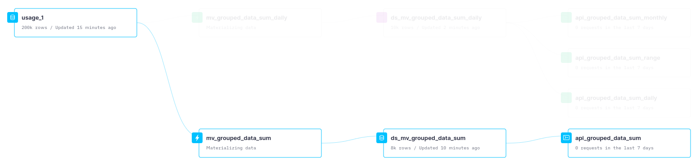
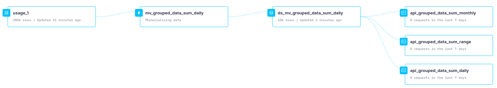
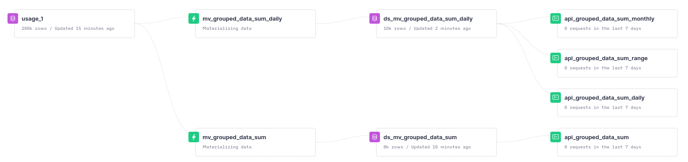

# MVs example

We have created this repo to explain some things you can do with your data in Tinybird to boost the performance of your queries.

In this use case, we have supposed that the goal is to compute the billing monthly, being able to filter by workspace_id, user_id and date.

Since we don't have a solid knowledge of the data and its meaning, that's what we have guessed:
- We have deduced that the billing can be calculated using the column *totalBalance*
- We have to work just with the columns: *workspaceId*, *userId*, *ts* and *totalBalance*

## Approaches

When dealing with a huge amount of data, you need to take advantages of some tools, such as materialized views (MV). Using them will help you to get a much better performance of your queries.
You can read more about materialized views and how to use them in these guides:
- [Create Materialized Views with Transformation Pipes](https://guides.tinybird.co/guide/materialized-views)
- [Calculating data on ingestion with Materialized Views](https://guides.tinybird.co/guide/materialized-columns)

We have defined two different approaches to solve this use case so that you can see which one fits better with your needs.

#### 1. Materializing the monthly billing using SummingMergeTree

In this first approach we will use the MV to save the data already pre-computed per month.

To do that, we have created the pipe *mv_grouped_data_sum*:
```
NODE retrieve
SQL >

    SELECT
        workspaceId,
        userId,
        toStartOfMonth(ts) AS month,
        sum(totalBalance) AS month_balance
    FROM usage_1
    GROUP BY
        workspaceId,
        userId,
        month

TYPE materialized
DATASOURCE ds_mv_grouped_data_sum
```


That way, we will be saving the data in the datasource *ds_mv_grouped_data_sum*, whose schema will be:

```
SCHEMA >
    `workspaceId` String,
    `userId` String,
    `month` Date,
    `month_balance` Nullable(Int64)

ENGINE "SummingMergeTree"
ENGINE_PARTITION_KEY "toYYYYMM(month)"
ENGINE_SORTING_KEY "workspaceId, userId, month"
```
Since the data is stored already pre-computed, the queries performed over this data will be much faster.

To retrieve the monthly billing for an specific workspace we just have to use the pipe called *api_grouped_data_sum* where:
- *workspaceId* and *month* are parameters
- you have the possibility of filtering by *userId*

```
%
SELECT
    workspaceId,
    
        userId,
    
    month,
    sum(month_balance) as month_balance
FROM ds_mv_grouped_data_sum
where workspaceId = {{String(workspace_id, '00015f9b-6ca4-4c17-b42a-4c63b31eb78c')}}
and month = {{String(month_selected, '2021-12-01')}}

    and userId = {{String(user_id, 'UfTzY4mFAbSrTNDEN0gvXBVSXjz1')}}

GROUP BY
    workspaceId,
    
        userId,
    
    month
```

The Data Flow defined for this case is the following:


> Data Flow created to compute the monthly billing using SummingMergeTree

#### 2. Materializing the daily billing using SummingMergeTree

In this second approach we will use the MV to save the data pre-computed per day.
This approach is a more flexible one, since you would be able to consult the information by day, by a selected range of dates or by month.

To do that, we have created the pipe *mv_grouped_data_sum_daily*:
```
NODE retrieve
SQL >

    SELECT
        workspaceId,
        userId,
        toDate(ts) AS day,
        sum(totalBalance) AS daily_balance
    FROM usage_1
    GROUP BY
        workspaceId,
        userId,
        day

TYPE materialized
DATASOURCE ds_mv_grouped_data_sum_daily
```

That way, we will be saving the data in the datasource *ds_mv_grouped_data_sum_daily*, whose schema will be:

```
SCHEMA >
    `workspaceId` String,
    `userId` String,
    `day` Date,
    `daily_balance` Nullable(Int64)

ENGINE "SummingMergeTree"
ENGINE_PARTITION_KEY "toYYYYMM(day)"
ENGINE_SORTING_KEY "workspaceId, userId, day"
```

Since the data is stored pre-computed by day, if you want to compute the billing for a range of dates or per month, the last calculation will be made "on-the-fly". Therefore, it's expected to be a bit slower than the approach 1; that's the trade-off for a more flexible approach (but don't worry because we are talking about ms!)

To retrieve the daily billing for an specific workspace we just have to use the pipe called *api_grouped_data_sum_daily*, where *workspaceId* and *day* are parameters. Additionaly, you have the possibility of filtering by *userId*:

```
%
NODE daily_bill_per_WS
SQL >

    %
    SELECT
        workspaceId,
        
            userId,
        
        day,
        sum(daily_balance) as daily_balance
    FROM ds_mv_grouped_data_sum_daily
    where workspaceId = {{String(workspace_id, '00015f9b-6ca4-4c17-b42a-4c63b31eb78c')}}
    and day = {{String(month_selected, '2021-12-15')}}
    
        and userId = {{String(user_id, 'UfTzY4mFAbSrTNDEN0gvXBVSXjz1')}}
    
    GROUP BY
        workspaceId,
        
            userId,
        
        day
```

In case we want to retrieve the billing for an specific workspace in a range of time, we have to use the pipe called *api_grouped_data_sum_range*, where *workspaceId* and *day* are parameters:

```
NODE range_bill_per_WS
SQL >

    %
    SELECT
        workspaceId,
        
            userId,
        
        sum(daily_balance) as daily_balance
    FROM ds_mv_grouped_data_sum_daily
    where workspaceId = {{String(workspace_id, '002a29aa-8ae1-4bde-9835-89b62ccf9558')}}
    and day between {{String(day_selected, '2021-12-05')}} AND {{String(day_selected, '2021-12-15')}}
    
        and userId = {{String(user_id, 'xn10QBBYPLRgvoelDITwL0f0Dw13')}}
    
    GROUP BY
        workspaceId
        
            ,
            userId
        
```

If we want to retrieve the monthly billing for an specific workspace, we will have to use the pipe called *api_grouped_data_sum_monthly*, where *workspaceId* and *day* are parameters:

```
%
SELECT
    workspaceId,
    
        userId,
    
    toStartOfMonth(day) as month,
    sum(daily_balance) as monthly_balance
FROM ds_mv_grouped_data_sum_daily
where workspaceId = {{String(workspace_id, '002a29aa-8ae1-4bde-9835-89b62ccf9558')}}
and month = {{String(month_selected, '2021-12-01')}}

    and userId = {{String(user_id, 'xn10QBBYPLRgvoelDITwL0f0Dw13')}}

GROUP BY
    workspaceId,
    
        userId
    
    month
```

The Data Flow defined for this case is the following:


> Data Flow created to compute the daily, monthly and for an specific range billing using SummingMergeTree

## Creating API endpoints

All the pipes to retrieve data that have been just explained can be easily transformed to API endpoints to consume the data directly.

You can read more about this [in this guide](https://guides.tinybird.co/guide/intro-to-exposing-data)

## How to reproduce the example

To reproduce the example in your workspace you have to download all the files contained in the folders datasources, pipes and endpoints of this repo and upload all of them to Tinybird.

IMPORTANT! *We have created all these files based on the schema of the datasource "usage_1" you have in the workspace at the moment. If you make some changes in that schema, these files should be updated too according to the changes.
Let us know in case this happens and you need any kind of help*.

You can do that following these steps:

1. Clone this repo to a local folder
2. Install [Tinybird CLI](https://docs.tinybird.co/cli.html)
3. Go to the folder that contains the files:
```
    cd tb-project/
```
4. Login to your workspace by running in the CLI the following command and providing your token (you can find it in the token section of the corresponding workspace):
```
    tb auth --region us-east
```
5. Upload all the files by using the commands:

```
    tb push --push-deps
```

Once you upload all these files to you workspace, you will have a Data Flow similar to the following:

> Data Flow created

## Additional comments

As explained in the previous section, this example has been created so that it can work in your workspace without requiring any changes.

However, we have detected some possible improvements that can be applied in the definition of the *usage_1* datasource.

Firstly, we recommend you to use the following datasource schema:
```
SCHEMA >
    `documentId` String `json:$.documentId`,
    `id` String `json:$.id`,
    `inputRiskLevel` Int16 `json:$.inputRiskLevel`,
    `inputWordCount` Int16 `json:$.inputWordCount`,
    `outputWordCount` Int16 `json:$.outputWordCount`,
    `projectId` String `json:$.projectId`,
    `requestId` String `json:$.requestId`,
    `skillId` String `json:$.skillId`,
    `translation` String `json:$.translation`,
    `ts` DateTime `json:$.ts`,
    `userId` String `json:$.userId`,
    `workspaceId` String `json:$.workspaceId`,
    `nValue` Int16 `json:$.nValue`,
    `planBalance` Nullable(Int32) `json:$.planBalance`,
    `planPaused` Nullable(UInt8) `json:$.planPaused`,
    `planUnlimited` Nullable(UInt8) `json:$.planUnlimited`,
    `totalBalance` Nullable(Int32) `json:$.totalBalance`,
    `trialing` Nullable(UInt8) `json:$.trialing`,
    `deviceToken` Nullable(String) `json:$.deviceToken`

ENGINE "MergeTree"
ENGINE_PARTITION_KEY "toYYYYMM(ts)"
ENGINE_SORTING_KEY "workspaceId, userId, ts"
```

As you can see, we have changed:
- ENGINE_PARTITION_KEY: related to how data is stored.
- ENGINE_SORTING_KEY: it is really important and it should be aligned with your use case. If you are filtering by workspaceId, userId and date, all these columns should be indexes, and therefore, there should be set as engine_sorting_key. This change would improve significantly the queries performance.

Additionally, you can analyze more in depth the content of each columns and try to change from String to LowCardinalty if the cardinality of the columns is not high (for instance, *translation*). This kind of change improves the memory needed to save and retrieve the data.

The definition of the datasource schema is currently just possible using the CLI.
To do that, you will have to upload it by running the command:
```
    tb push datasource/usage_1.datasource
```

After that, you will have to append data to it, following the process you have defined at the moment.
